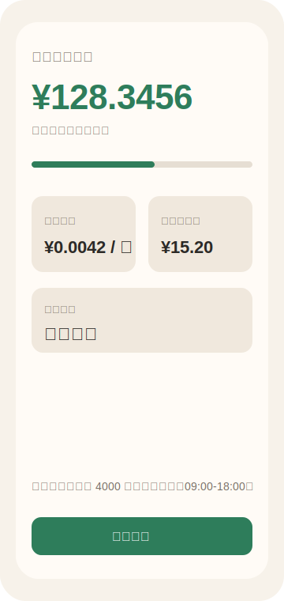
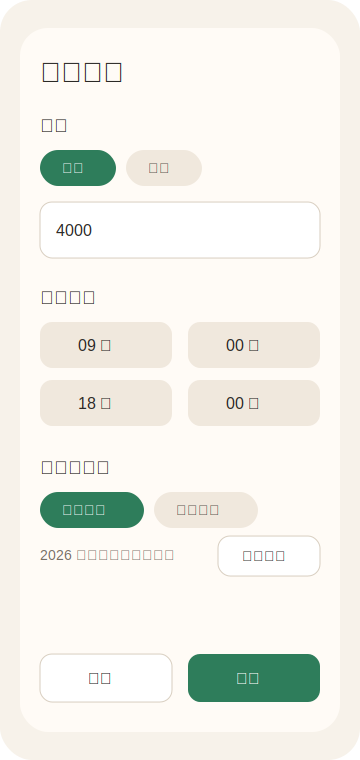

# BeFxxkedSavingJar 💸

一个 Android 小工具：输入月薪或年薪后，按工作日和工作时间折算出你每秒赚多少钱，并在主屏实时显示“今天已经赚到”的金额。

它的核心乐趣很简单：哪怕每秒只涨一点点，也要让你看见它在涨。😌

## 截图 📱

> 当前截图为 README 预览图。后续可以用真机截图覆盖 `docs/screenshots/main-screen.svg` 和 `docs/screenshots/settings-screen.svg`。

| 主屏 | 设置页 |
| --- | --- |
|  |  |

## 主要功能 ✨

- 💰 支持月薪 / 年薪输入
- ⏱️ 实时显示今天已经赚到的钱
- 🧮 自动计算每秒收入、每小时收入
- 🔢 低收入场景下自动提高小数精度，避免一直显示 `¥0.00`
- 🕘 支持设置上班 / 下班时间
- 📅 支持两种工作日规则：
  - 中国法定工作日
  - 每周固定工作日
- 🇨🇳 内置 2026 年中国法定节假日和调休数据
- 🌐 支持联网同步节假日数据，失败时自动回退到内置数据或固定工作日
- 💾 使用 DataStore 保存本地设置
- 🧪 核心计算、工作日判断、节假日解析均有单元测试

## 技术栈 🛠️

- Kotlin
- Jetpack Compose
- Material 3
- Android DataStore
- Kotlin Coroutines
- JUnit
- Gradle Kotlin DSL

## 重要迭代记录 🧭

- `chore: initialize Android project`
  - 初始化 Android + Compose 项目

- `feat: add income calculator`
  - 增加收入折算核心逻辑
  - 支持月薪、年薪、每秒收入、今日已赚

- `feat: add realtime earning screen`
  - 增加实时主屏
  - 每秒刷新今日已赚金额

- `feat: persist earning settings`
  - 使用 DataStore 保存薪资和工作时间设置

- `feat: derive work duration from schedule`
  - 移除手动“每天工作 8 小时”
  - 改为根据上下班时间自动计算工作时长

- `feat: add custom workday selection`
  - 增加每周固定工作日选择

- `feat: support China legal workdays`
  - 增加中国法定工作日模式
  - 支持联网查询节假日和调休数据

- `feat: add built-in China legal calendar`
  - 内置 2026 年中国法定节假日和调休数据
  - 网络失败时仍可正常判断工作日

- `style: refine earning screen layout`
  - 优化主屏和设置页 UI
  - 设置页按薪资、工作时间、工作日规则分组

## 当前规则说明 📌

中国法定工作日模式下：

- 优先使用当前系统年份对应的远程同步数据
- 如果远程同步失败，优先使用内置的当前年份数据
- 如果当前年份没有内置数据，则回退到固定周一到周五
- 不会把上一年的法定日历误用到下一年

## Roadmap 🗺️

- [ ] 替换正式 App 名称和图标
- [ ] 做一版更完整的视觉设计
- [ ] 增加真机截图
- [ ] 增加 Release 签名配置
- [ ] 准备首次可安装测试 APK
- [ ] 后续内置 2027 年法定节假日数据
